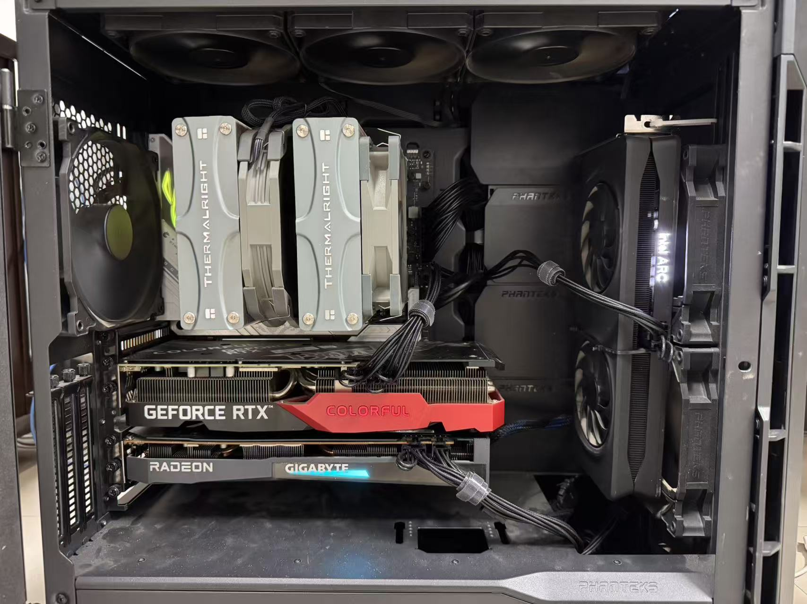
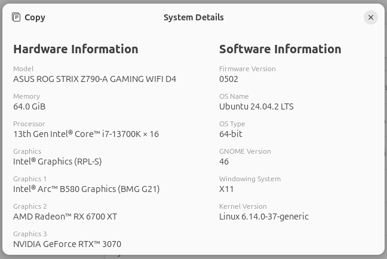
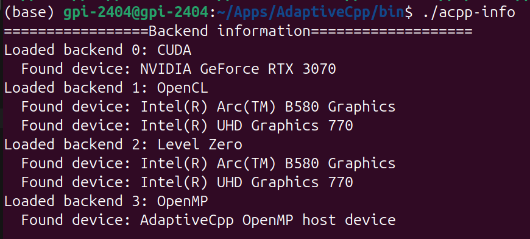
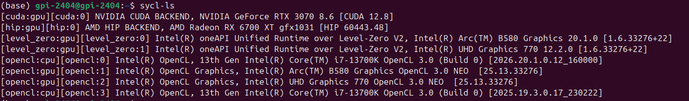

<p align="center">
    <a href="https://github.com/XFluids/XFluids">
        
    </a>
    <br>
    <a href="https://github.com/XFluids/XFluids/pulls">
        
    </a>    
    <a href="https://github.com/XFluids/XFluids/blob/master/LICENSE">
        
    </a>    
    <a href="https://github.com/XFluids/XFluids/blob/main/docs/User_Manual_EN.md">
        
    </a>  
    <a href="https://github.com/XFluids/XFluids/blob/main/docs/User_Manual_CN.md">
        
    </a>  
    <a href="https://doi.org/10.1016/j.cpc.2026.110095">
        
    </a> 
</p>

XFluids is a parallelized SYstem-wide Compute Language (SYCL) C++ solver for large-scale high-resolution simulations of compressible multi-component reacting flows. It is developed by [Prof. Shucheng Pan&#39;s](https://teacher.nwpu.edu.cn/span.html) group at the School of Aeronautics, Northwestern Polytechincal University.

main developers:

- Jinlong Li (ljl66623@mail.nwpu.edu.cn)
- Renfei Zhang (zrf@mail.nwpu.edu.cn)
- Shucheng Pan (shucheng.pan@nwpu.edu.cn)

other contributors: 
- Yixuan Lian

## References
If you use XFluids for academic aplications, please cite our paper.(https://doi.org/10.1016/j.cpc.2026.110095)

## Features
- Support CPU, GPU (integrated & discrete), and FPGA without porting the code
- General for multi-vendor devices (Intel/NVIDIA/AMD/Hygon ... )
- Hybrid calculate (CPU + GPU)
- High portability, productivity, and performace
- GPU-aware MPI
- Highly optimized kernels & device functions for multicomponent flows and chemical reaction 
- ongoing work: sharp-interface method, curvilinear mesh, turbulence models ...

## Supported GPUs
The following GPUs have been tested:
- NVIDIA
  - Data center GPU: A100, P100, PRO6000
  - Gaming GPUs: RTX 4090, RTX 3090/3080/3070/3060TI, T600, RTX 1080
- AMD
  - Data center GPU: MI50, MI100
  - Gaming GPUs: RX 7900XTX, RX 6800XT, RX 6700XT, Pro VII
- Intel
  - Gaming GPUs: ARC A770/A380, ARC B580
  - Integrated GPUs: UHD P630, UHD 750, UHD 770

## 1. Manually installed Dependencies
### 1.1. One of the following two SYCL implementations:
  NOTE: SYCL implementation of AdaptiveCpp is strongly recommended for XFluids, and the support of Intel oneAPI will be deprecated.
- #### [AdaptiveCpp](https://github.com/AdaptiveCpp/AdaptiveCpp)(known as OpenSYCL/hipSYCL) based on [LLVM &gt;= 14.0](https://apt.llvm.org/)
  - ##### An internal AdaptiveCpp can be compiled to SSCP or SSMP(see AdaptiveCpp offical documentation), it is resolved by XFluids automatilly but set "COMPILER_PATH" manually
    - ##### SSCP: Install llvm from org, CUDA/ROCm for NVIDIA/HIP GPUs, and set "COMPILER_PATH" to llvm.
      ````bash
      wget https://apt.llvm.org/llvm.sh
      chmod +x llvm.sh                  # repalce "<llvm-version>" with number 14/16/18
      sudo ./llvm.sh <llvm-version> all # NOTE That: libclang-<llvm-version>-dev,libomp-<llvm-version>-dev are needed
      export COMPILER_PATH=/usr/lib/llvm-<llvm-version>
      ````
    - ##### SSMP: Needn't llvm.org, set system environment "COMPILER_PATH" to CUDA/ROCm.
      ````bash
      export COMPILER_PATH=/path/to/cuda-toolkit # for cuda SSMP AdaptiveCpp compilation
      ````
      ````bash
      export COMPILER_PATH=/path/to/rocm-release # for hip  SSMP AdaptiveCpp compilation
      ````
  - ##### If a system installed AdaptiveCpp is used, please set cmake option "ACPP_PATH" or export system environment variables $ACPP_PATH.
    ````cmake
    cmake -DACPP_PATH=/path/to/AdaptiveCpp ..
    ````
    ````bash
    export ACPP_PATH=/path/to/AdaptiveCpp && \
    cmake ..
    ````

- #### [Intel oneAPI < 2025.3.0](https://www.intel.com/content/www/us/en/developer/tools/oneapi/base-toolkit-download.html?operatingsystem=linux&distributions=offline), and [codeplay plugins](https://codeplay.com/solutions/oneapi) are needed for targeting NVIDIA and AMD backends
  - The [**deps_oneAPI**](https://github.com/XFluids/XFluids/releases/tag/deps_oneAPI) release in this repository provides the oneAPI base toolkit (2025.0.0) and corresponding Codeplay plugins. Other versions should be prepared by the user.
    
  - ##### activate environment for oneAPI appended codeplay sultion libs
    
    ````bash
    source /path/to/oneAPI/setvars --include-intel-llvm
    ````
  
- #### [Intel oneAPI >= 2025.3.0](https://www.intel.com/content/www/us/en/developer/tools/oneapi/base-toolkit-download.html?operatingsystem=linux&distributions=offline), and [Intel Unified Runtime](https://github.com/intel/llvm/releases/tag/v6.3.0/sycl_linux.tar.gz) are needed for targeting NVIDIA and AMD backends
  
  - After installing the oneAPI base toolkit 25.3.1, download and extract the Intel Unified Runtime v6.3.0.
    
  - **Note on environment loading order**: It is critical to source the oneAPI 25.3.1 variables first, followed by the Unified Runtime environment. Otherwise, runtime errors may occur, and valid CUDA/ROCm devices may not be detected.
    
      ```bash
      source /path/to/oneAPI_25.3.1/setvars.sh
      
      export CPATH=/path/to/UR/include:$CPATH
      export PATH=/path/to/UR/bin:$PATH
      export LD_LIBRARY_PATH=/path/to/UR/lib:$LD_LIBRARY_PATH
      ```

## 2. Select target device in SYCL project
### 2.1 Test Platform

Our test platform consists of an Intel i7-13700K, NVIDIA RTX 3070, AMD RX 6700XT, and Intel Arc B580.
<p align="center">
  
  
</p>

### 2.2. Device discovery

### 2.2.1 AdaptiveCpp device discovery: exec "acpp-info" in cmd for device counting
The failure of the AdaptiveCpp implementation to recognize AMD devices is due to the ROCm backend support not being enabled during the AdaptiveCpp installation.
<p align="center">
  
</p>

### 2.2.2. Intel oneAPI device discovery: exec "sycl-ls" in cmd for device counting
As shown in the figure, the oneAPI implementation path on our test platform can simultaneously detect the Intel CPU, Intel integrated GPU (iGPU), and discrete GPUs (dGPU) from Intel, NVIDIA, and AMD.
<p align="center">
  
</p>

### 2.3. Queue construction: set integer platform_id and device_id("DeviceSelect" in json file or option: -dev)
NOTE: platform_id and device_id are revealed in [2.1-Device-discovery]("2.1. Device discovery")
  ````C++
  auto device = sycl::platform::get_platforms()[platform_id].get_devices()[device_id];
  sycl::queue q(device);
  ````

## 3. Compile and usage of this project
### 3.1. Read root <XFluids/CMakeLists.txt>

- `CMAKE_BUILD_TYPE` is set to "Release" by default, SYCL code would target to host while ${CMAKE_BUILD_TYPE}==Debug
- set `INIT_SAMPLE` as the problem being tested, path to "species_list.dat" and "reaction_list.dat" should be given to `MIXTURE_MODEL`
- MPI and AWARE-MPI support added in project, AWARE_MPI need specific GPU-ENABLED mpi version, details referenced in [4-mpi-libs]("4. MPI libs")
- `VENDOR_SUBMIT` allows throwing some parallism tuning cuda/hip model to their GPU, only supportted by AdaptiveCpp compile environment

### 3.2. BUILD and RUN
- build with cmake

  ````bash
  cd ./XFluids
  mkdir build && cd ./build && cmake .. && make -j
  ````
- #### 3.2.1. Local machine running
- XFluids automatically read <XFluids/settings/*.json> file depending on INIT_SAMPLE setting

  ````bash
  ./XFluids
  ````
- Append options to XFluids in cmd for another settings, all options are optional, all options are listed in [6. executable file options]("6. Executable file options")

  ````bash
  ./XFluids -dev=1,1,0
  mpirun -n mx*my*mz ./XFluids -mpi=mx,my,mz -dev=1,0,0
  ````
- #### 3.2.2. Slurm sbatch running on Hygon(KunShan) supercompute center

  ````bash
  cd ./XFluids/scripts/KS-DCU
  sbatch ./1node.slurm
  sbatch ./2node.slurm
  ````

## 4. MPI libs
NOTE: MPI functionality is not supported by Intel oneAPI SYCL implementation
### 4.1. Set MPI_PATH browsed by cmake before build

- cmake system of this project browse libmpi.so automatically in path of ${MPI_PATH}/lib, please export MPI_PATH to the mpi you want:

  ````cmd
  export MPI_PATH=/home/ompi
  ````
### 4.2. The value of MPI_HOME, MPI_INC, path of MPI_CXX(libmpi.so/linmpicxx.so) output on screen while it is found

````cmake
  -- MPI settings:
  --   MPI_HOME:/home/ompi
  --   MPI_INC: /home/ompi/include added
  --   MPI_CXX lib located: /home/ompi/lib/libmpi.so found
````

## 5. .json configure file arguments

- reading commits in src file: <${workspaceFolder}/src/read_ini/settings/read_json.cpp>

## 6. Executable file options

| name of options |                                       function                                       |    type    |
| :-------------- | :----------------------------------------------------------------------------------: | :---------: |
| -domain         |              domain size                        : length, width, height              |    float    |
| -run            |   domain resolution and running steps: X_inner,Y_inner,Z_inner,nStepmax(if given)    |     int     |
| -blk            | initial local work-group size, dim_blk_x, dim_blk_y, dim_blk_z,DtBlockSize(if given) |     int     |
| -dev            |             device counting and selecting: device munber,platform,device             |     int     |
| -mpi            |                             mpi cartesian size: mx,my,mz                             |     int     |
| -mpi-s          |                                  "weak" or "strong"                                  | std::string |
| -mpidbg         |         append the option with or without value to open mpi multi-rank debug         | just append |

## 7. Output data format
NOTE: Output data format is controlled by the value of "OutDAT", "OutVTI" in .json file
### 7.1. Tecplot file

- import .dat files of all ranks of one Step for visualization, points overlapped between boundarys of ranks(3D parallel tecplot format file visualization is not supportted, using tecplot for 1D visualization is recommended)

### 7.2. VTK file

- use `paraview` to open `*.pvti` files for MPI visualization(1D visualization is not allowed, using paraview for 2/3D visualization is recommended);

## Cite XFluids
```
@misc{li2024xfluids,
      title={XFluids: A unified cross-architecture heterogeneous reacting flows simulation solver and its applications for multi-component shock-bubble interactions}, 
      author={Jinlong Li and Shucheng Pan},
      year={2024},
      eprint={2403.05910},
      archivePrefix={arXiv}
}
```
## Acknowledgments

XFluids has received financial support from the following fundings:
- The Guanghe foundation (Grant No. ghfund202302016412)
- The National Natural Science Foundation of China (Grant No. 11902271)