# XFLUIDS v0.1 User Manual

## 1. 安装与环境配置

本项目提供两套基于 SYCL 的实现（implementation）：**Intel oneAPI** 与 **AdaptiveCpp**。为了简化复杂的依赖配置，项目根目录下提供了自动化脚本（Shell Script），能够根据当前硬件环境（NVIDIA/AMD/Intel GPU）自动下载并部署所需工具链。


### 1.1 SYCL implementation选择

|  | Intel oneAPI                             | AdaptiveCpp                                             |
| :--------------- | :-------------------------------------------- | :----------------------------------------------------------- |
| **安装包体积**   | 较大 (约 2.3GB)                               | 较小 (<10MB)                                                 |
| **编译器依赖**   | 自带 `icpx` / `clang++`                       | **必须依赖 LLVM 环境**                                       |
| **适配性**       | 支持隔离安装，适配较好                        | 若无系统级 LLVM，须通过 Conda 环境安装 |
| **GPU 后端支持** | 针对 Intel 设备高度优化；支持 NVIDIA/AMD (需插件) | 支持 NVIDIA (CUDA)，AMD (ROCm)，Intel (SYCL) 以及 **Generic (SSCP)** 模式 |
| **额外功能** | 自带MPI以及Intel的数学库(比如oneMKL) ，可以采用Intel性能分析工具（比如VTune和Advisor）| 需要额外安装MPI和其他数学库，无性能分析工具 |
> **特别注意**：在超算等无 `sudo` 权限的平台上，如果无法通过 `apt` 安装原生 LLVM，对于AdaptiveCpp  SYCL implementation需依赖项目提供的 Conda 环境来部署 LLVM 工具链。


### 1.2 下载

从github下载XFluids的仓库：

```bash
git clone https://github.com/XFluids/XFluids.git
```

然后根据1.1中所选择的SYCL implementation，执行仓库中安装脚本`run_install_oneAPI.sh`或者`run_install_AdaptiveCpp.sh`下载相关依赖的安装包：

*   **资源获取**：
    安装脚本会自动从 GitHub Release 下载指定版本的依赖包至 `external/downloads` 目录。
    
    > **校验机制**：下载前会优先检索本地文件，通过 **SHA256 哈希值** 比对文件完整性。如果本地存在且校验通过，则跳过下载；否则自动调用 `curl` 获取。这避免了弱网环境下的重复下载失败问题。
*   **后端自动检测**：
    安装脚本会检测系统中是否存在 `nvcc`或`/usr/local/cuda` (NVIDIA), `hipcc`或`/opt/rocm` (AMD)。
    
    *   若检测到 NVIDIA GPU，将配置 CUDA 后端。
    *   若检测到 AMD GPU，将配置 ROCm 后端。
    *   若均未检测到，默认配置 Intel Level Zero/OpenCL 后端。
    > **特别注意**：对于混合模式，用户需要根据个人系统中不同vendor的设备组合进行手动配置。

#### Implementation A: Intel oneAPI
基于 Intel 官方工具链，支持通过Codeplay插件适配 NVIDIA/AMD GPU。

> 对于较老的设备（比如P100）,通过测试发现需要使用旧版本的oneAPI (2024.0.0)搭配icpx来编译，才能提高运行效率。

*   **安装流程**：
    
    1.  安装脚本自动安装 Intel oneAPI Base Toolkit (2025.0)。
    2.  **插件适配**：若检测到非 Intel GPU，会自动安装 Codeplay 提供的插件（目前支持 CUDA 12.0 或 ROCm 5.4/6.1）。
    3.  使用 Intel `clang++` 编译器编译并安装 Boost 1.83 库。
*   **安装命令**：
    
    ```bash
    chmod +x run_install_oneAPI.sh
    ./run_install_oneAPI.sh
    ```
    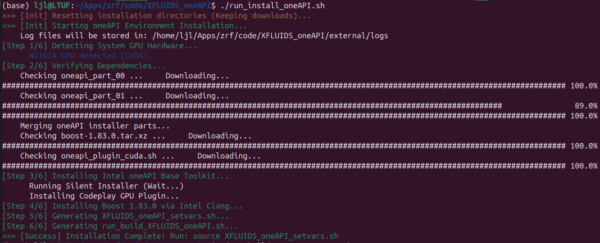

#### Implementation B：AdaptiveCpp
通过 Conda 环境实现隔离，无需 `sudo` 权限即可部署 LLVM。
*   **安装流程**：
    1.  **Conda 隔离**：自动安装 Miniconda，并创建名为 `XFLUIDS` 的独立环境。
    2.  **LLVM 部署**：在 Conda 环境中安装 LLVM/Clang 16 工具链，避免污染宿主机系统。
    3.  **Boost 编译**：使用 Conda 内置的 `clang++` 编译 Boost 1.83。
    4.  **AdaptiveCpp**：基于检测到的后端编译安装 AdaptiveCpp 运行时。
*   **安装命令**：
    
    ```bash
    chmod +x run_install_AdaptiveCpp.sh
    ./run_install_AdaptiveCpp.sh
    ```
    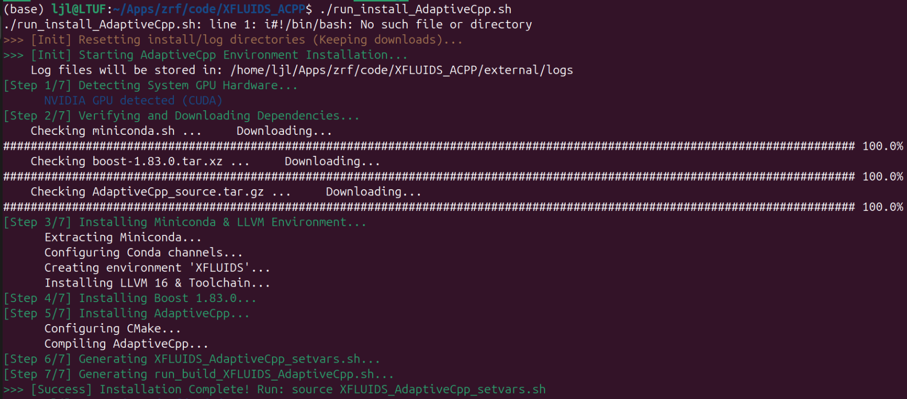


## 2. 项目编译 (Build)

依赖安装完成后，安装脚本（`run_install_oneAPI.sh`或`run_install_AdaptiveCpp.sh`）会在根目录生成对应的环境加载脚本（`XFLUIDS_oneAPI_setvars.sh`或`XFLUIDS_AdaptiveCpp_setvars.sh`）和编译脚本（`run_build_oneAPI.sh`或`run_build_AdaptiveCpp.sh`）。


### 2.1 运行编译脚本

使用生成的编译脚本进行标准编译（Release 模式）：

*   **oneAPI implementation**：
    
    oneAPI implementation的编译脚本默认编译为CUDA版本，如果需要编译为ROCm/Intel/CPU版本，则需要手动将CMakeList.txt中`SelectDv`值修改为hip/intel/host。同时，编译脚本默认`ARCH`为86，需要根据个人设备情况修改CMakeList.txt中的`ARCH`值。
    
    ```bash
    ./run_build_XFLUIDS_oneAPI.sh
    ```
    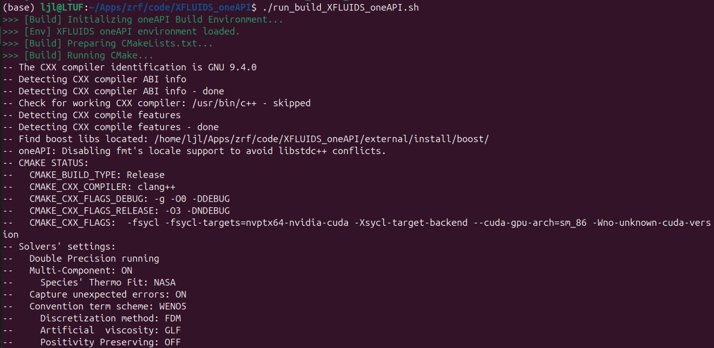
    
    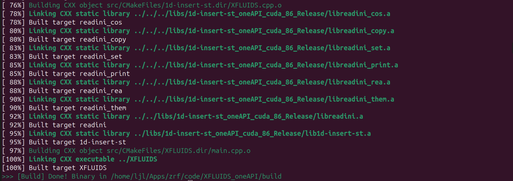
    
*   **AdaptiveCpp implementation**：
    
    AdaptiveCpp implementation的编译脚本默认编译为`generic`版本，无需再次手动修改CMakeList.txt文件。
    
    ```bash
    ./run_build_XFLUIDS_AdaptiveCpp.sh
    ```
    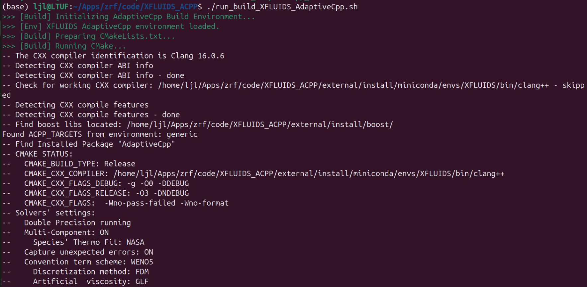
    
    

编译成功后，二进制文件 `XFLUIDS` 将位于 `./build` 目录下。


### 2.2 加载环境变量

编译脚本内置了加载环境变量，手动编译则**必须**加载对应的环境变量：

*   **oneAPI implementation**：
    
    ```bash
    source XFLUIDS_oneAPI_setvars.sh
    ```
    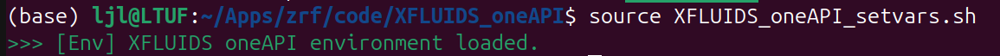
    
*   **AdaptiveCpp implementation**：
    
    ```bash
    source XFLUIDS_AdaptiveCpp_setvars.sh
    ```
    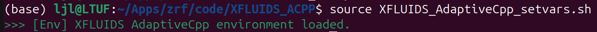


## 3. 程序运行

### 3.1 运行示例
*   **oneAPI implementation**：
    
    ```bash
    cd build
    source ../XFLUIDS_oneAPI_setvars.sh
    ./XFLUIDS -dev=1,2,0
    ```
    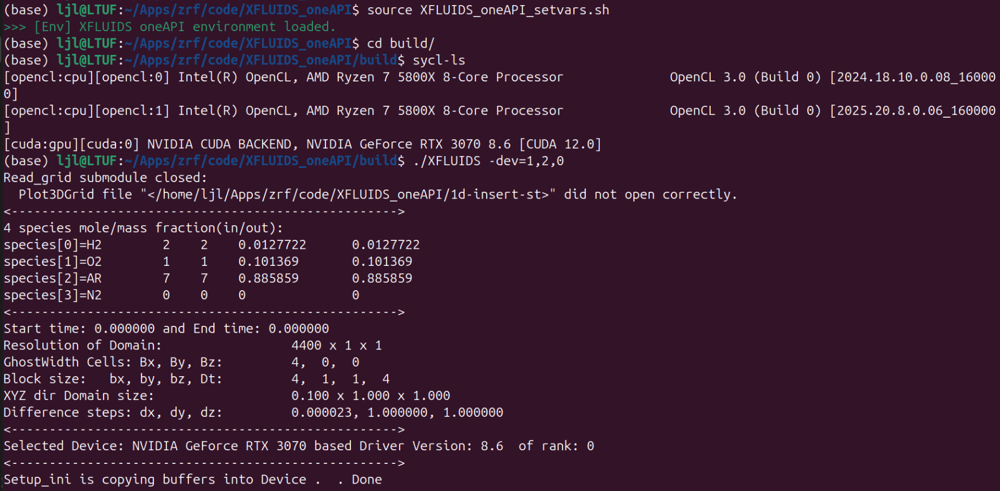

通过`watch -n 0 nvidia-smi`监控GPU负载，确保程序在特定的GPU上运行。
	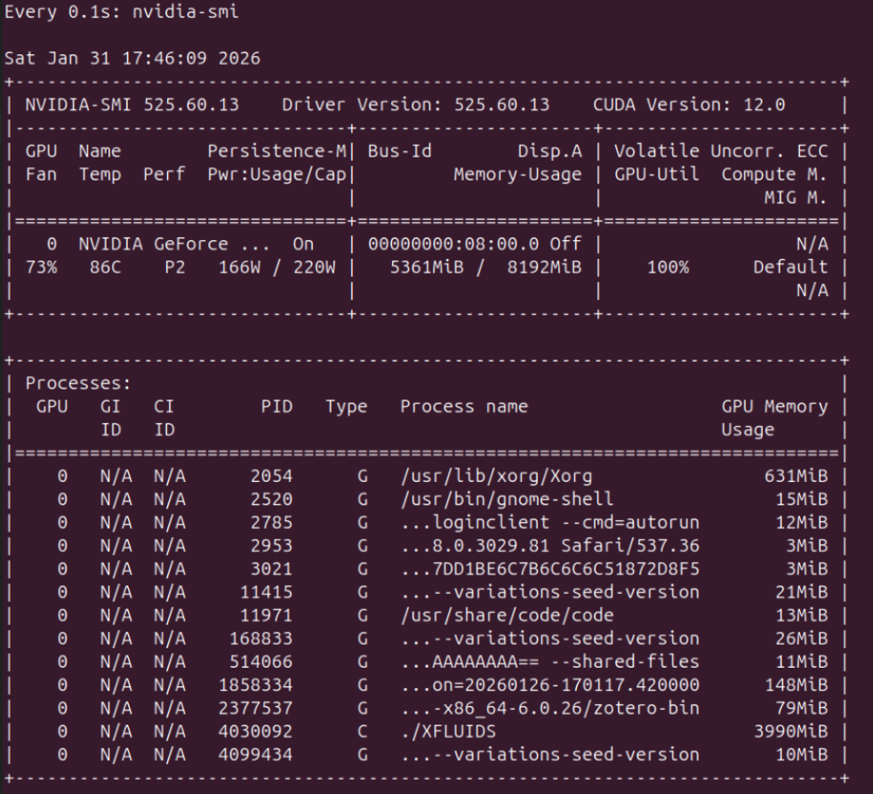

*   **AdaptiveCpp implementation**：
    
    ```bash
    cd build
    source ../XFLUIDS_AdaptiveCpp_setvars.sh
    ./XFLUIDS -dev=1,1,0
    ```
    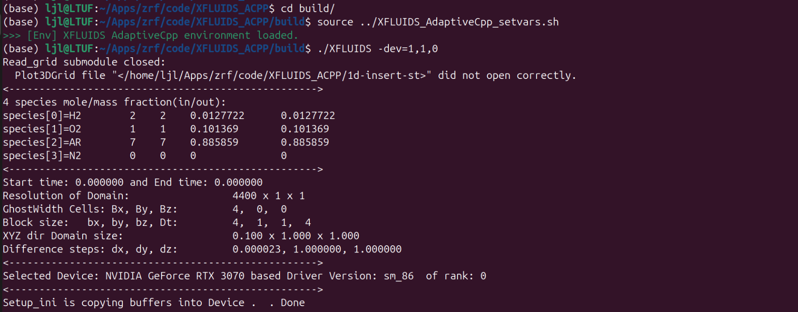

通过`watch -n 0 nvidia-smi`监控GPU负载，确保程序在特定的GPU上运行。
	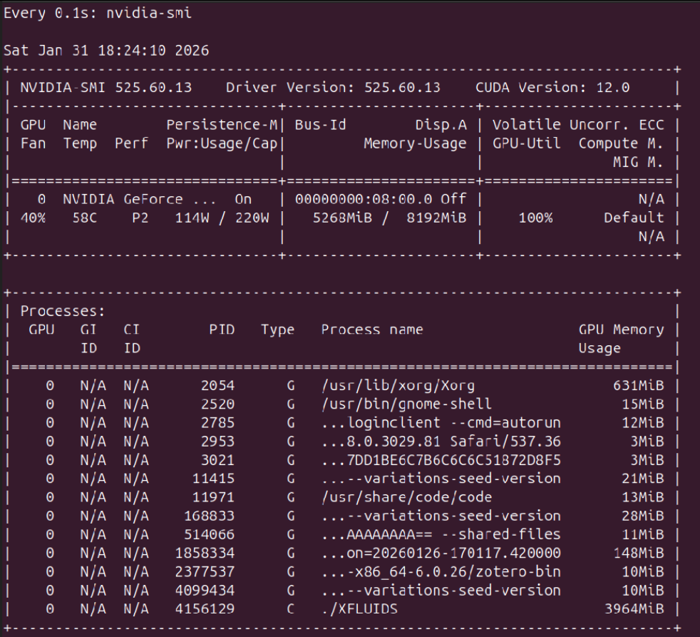

**CPU multithreading**：

如果选择CPU作为运行设备，oneAPI和AdaptiveCpp的SYCL implementation都会采用多线程并行，如下图所示，在8核（关闭了超线程）的AMD 5800X上，XFLUIDS以多线程方式运行。
	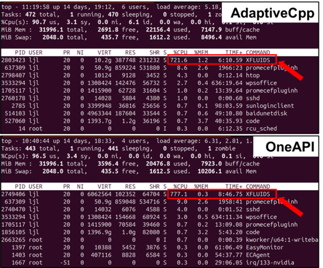


### 3.2 运行时参数

*   **设备选择**：通过 `-dev` 参数指定。
    
    ```bash
    ./XFLUIDS -dev=1,1,0  # 第一个参数为选择的设备数量，第二个参数为平台号，第三个参数为设备号
    ```
*   **分辨率与运行步数**：
    
    ```bash
    ./XFLUIDS -run=2048,2048,0,50 # 三个方向的分辨率和运行的步数
    ```
*   **MPI多设备运行**：
    
    ```bash
    mpirun -n mx*my*mz ./XFLUIDS -mpi=mx,my,mz
    ```

> 注意: -dev和-run的默认参数已经写在测试算例的json文件中（`settings`文件夹中）

### 3.2 关键特性：自适应 nd-range

本项目包含针对异构硬件的 **自适应 nd-range 调优** 功能。
1.  **第一遍运行（搜索阶段）**：
    初次运行时，求解器会在前几十步尝试不同的nd-range参数。终端输出会显示正在尝试的参数。
    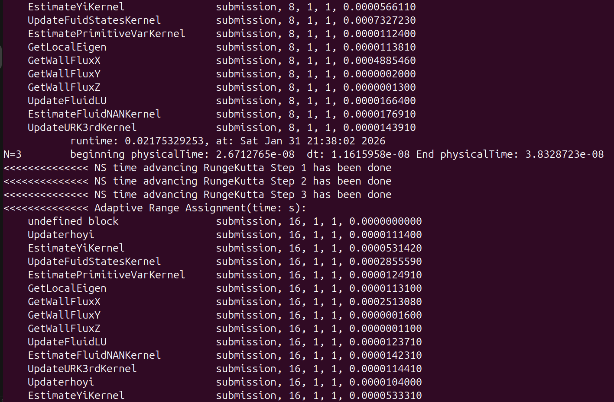
    *   **要求**：建议至少运行 **50 步**，直到终端不再打印调优信息，此时最佳配置已被保存为二进制缓存文件。
2.  **第二遍运行（计算阶段）**：
    再次运行相同分辨率算例时，程序会直接读取最佳 nd-range 配置，性能达到最优。

> **Hybrid 模式注意**：在混合计算模式下，虽然该功能被部分硬编码覆盖，但仍需运行两遍。第一遍只需运行 **2 步** 即可生成必要的缓存文件，第二遍运行即可进行正式计算。


## 4. 算例示例
在完成相关依赖的安装和对XFLUIDS的初次编译后，在example路径下提供了两个算例的算例配置脚本文件，运行算例配置脚本文件后会修改CMakeList.txt中的算例配置，重新运行编译脚本后可在build中运行XFLUIDS进行计算。
### 4.1 1d-insert-st

```bash
cd example/1d-insert-st
chmod 777 activate_case.sh
./activate_case.sh

cd ../..
./run_build_oneAPI.sh # oneAPI版本
# ./run_build_AdaptiveCpp.sh # AdaptiveCpp版本
cd build/
source ../XFLUIDS_oneAPI_setvars.sh # oneAPI版本
#source ../XFLUIDS_AdaptiveCpp_setvars.sh # AdaptiveCpp版本

./XFLUIDS
```

### 4.2 2d-euler-vortex

```bash
cd example/2d-euler-vortex
chmod 777 activate_case.sh
./activate_case.sh

cd ../..
./run_build_oneAPI.sh # oneAPI版本
# ./run_build_AdaptiveCpp.sh # AdaptiveCpp版本
cd build/
source ../XFLUIDS_oneAPI_setvars.sh # oneAPI版本
#source ../XFLUIDS_AdaptiveCpp_setvars.sh # AdaptiveCpp版本

./XFLUIDS
```


## 5. 混合计算模式 (Hybrid heterogeneous computation)

本章节介绍基于 **Intel oneAPI** 的 CPU (Host) + GPU (Device) 异构融合计算模式。
> **注意**：为展示该功能，branch （hybrid）中针对 **AMD Ryzen 9 9950X + NVIDIA RTX 3080** 平台进行了硬编码实现。如需移植到其他硬件，需修改源码中的分辨率与分区负载参数。


### 5.1 设备与负载分配

为简化设置，branch （hybrid）在 **Y 方向** 对计算域进行了分块：
*   **Rank 0 (GPU)**：负责调用 GPU 进行并行计算。
    *   **host线程绑定**：绑定到 **物理核 0** (单线程调用GPU)。
*   **Rank 1 (CPU)**：利用 CPU 的多核性能计算。
    *   **host线程绑定**：绑定到 **物理核 1-15** (采用15 个线程进行计算)。


### 5.2 依赖下载安装

和上述oneAPI implementation的下载安装相同，通过脚本文件可以实现一键安装。


### 5.3 编译 Hybrid 版本

Hybrid 模式需要通过 CMake 手动开启 `ENABLE_HYBRID` 宏。
```bash
# 加载环境
source XFLUIDS_oneAPI_setvars.sh

# 建立构建目录
mkdir build_hybrid && cd build_hybrid

# 手动编译 (需根据实际路径修改 BOOST_ROOT)
cmake .. \
    -DENABLE_HYBRID=ON \
    -DUSE_MPI=ON \
    -DTEST_CASE=3 \
    -DBOOST_ROOT=/your/path/to/external/install/boost \
    -DCMAKE_EXE_LINKER_FLAGS="-L/your/path/to/external/install/boost/lib -lboost_filesystem -lboost_system"

make -j
```
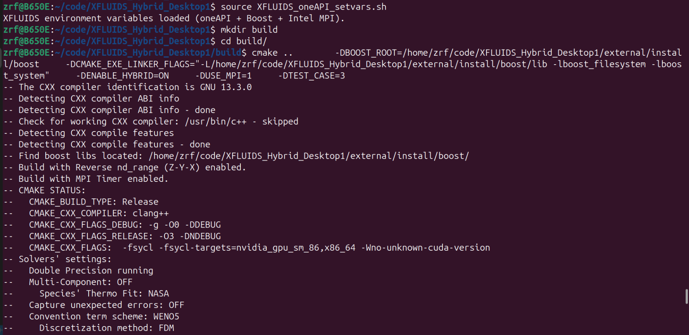
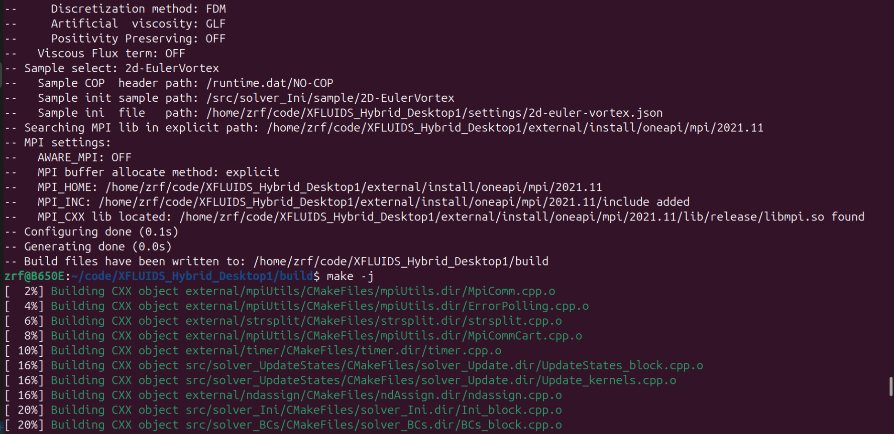


### 5.4 运行与测试用例 (TEST_CASE)

通过 `TEST_CASE` 宏与 `launch.sh` 脚本配合，切换三种测试模式。

*   **CASE 1: 纯 CPU 模式 (9950X)**
    
    ```bash
    # CMake 参数: -DTEST_CASE=1
    mpirun -n 1 ./XFLUIDS
    ```
    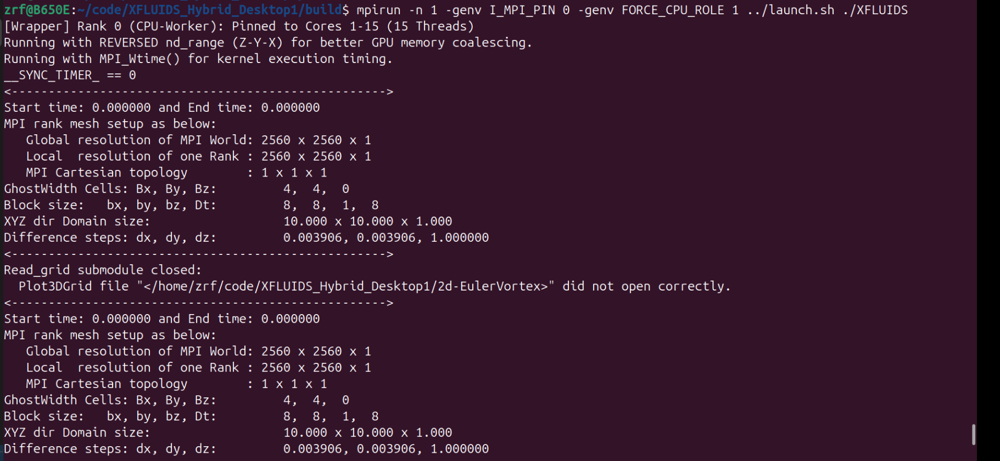

通过`top`可以监控CPU负载情况。
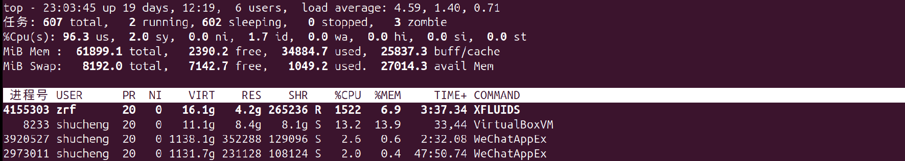

*   **CASE 2: 纯 GPU 模式 (RTX 3080)**
    
    ```bash
    # CMake 参数: -DTEST_CASE=2
    mpirun -n 1 ./XFLUIDS
    ```
    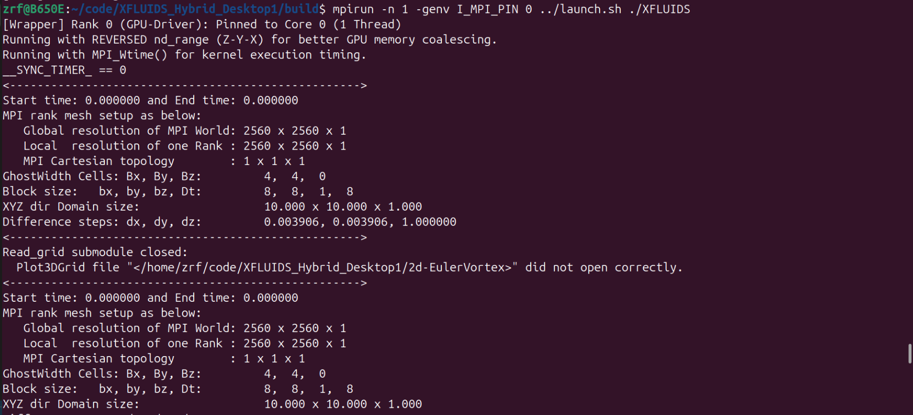

*   **CASE 3: 融合计算模式 (GPU + CPU)**
    开启双进程，脚本自动将 Rank 0 绑核到 GPU 驱动，Rank 1 绑核到 CPU 计算。
    > 注意：对于AMD CPU，oneAPI的clang++默认在MPI多进程环境下的CPU计算只调用num_cores/number_ranks个进程。为确保CPU满载，`launch.sh` 脚本负责识别 MPI Rank 并执行 `taskset` 核心绑定。
    
    ```bash
    # CMake 参数: -DTEST_CASE=3
    mpirun -n 2 -genv I_MPI_PIN 0 ../launch.sh ./XFLUIDS
    ```
    
    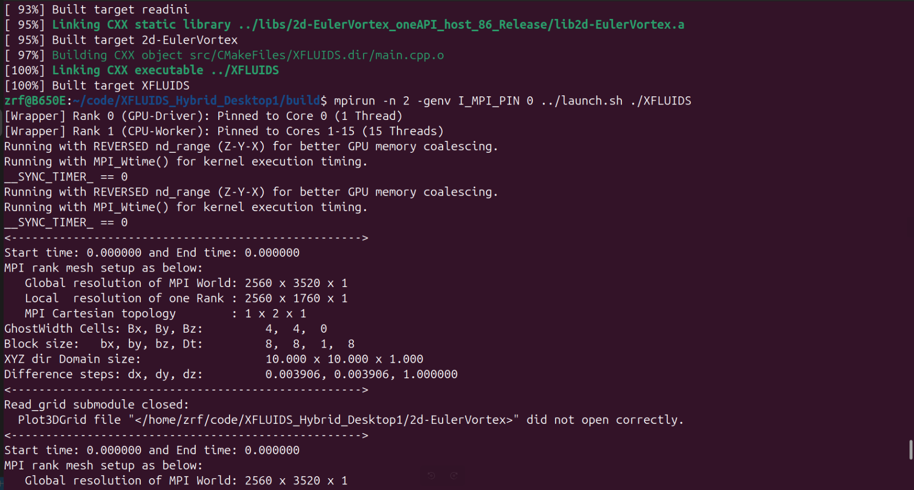
    

通过`top`和`watch -n 0 nvidia-smi`监控CPU/GPU负载情况。

> 显然，第一个XFLUIDS进程执行在 **CPU 上（15个线程）**, 而第二个XFLUIDS进程执行在 **GPU上（通过一个CPU线程管理）**

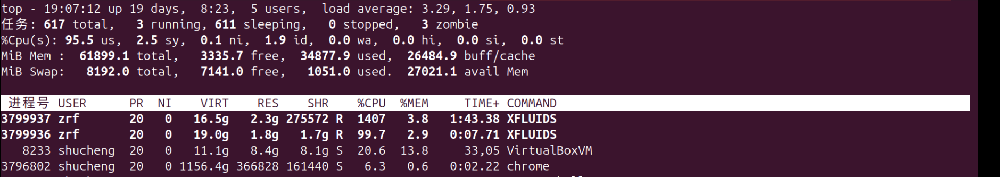

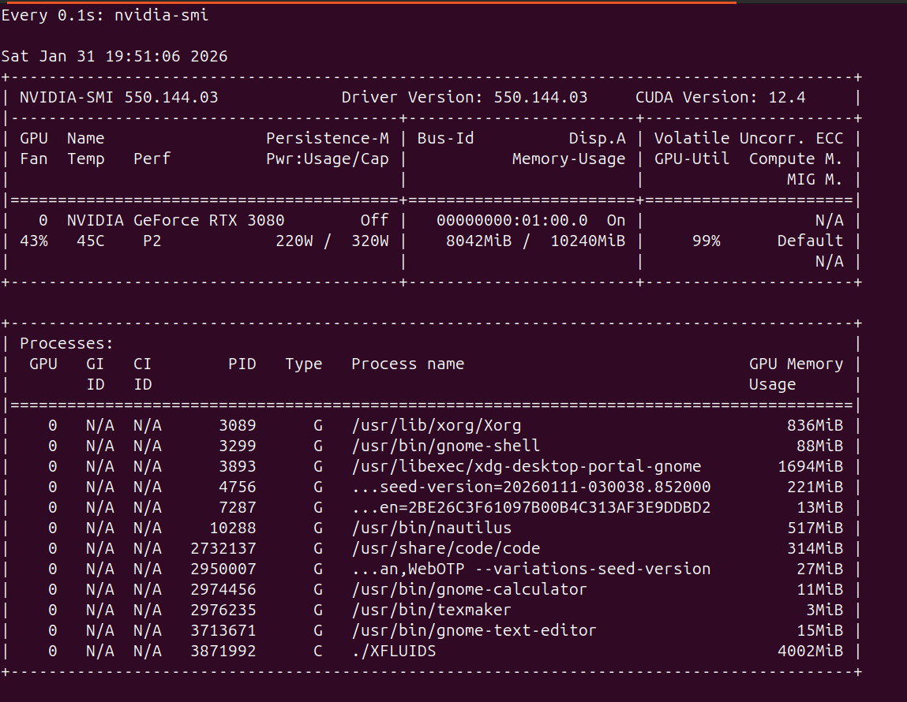


### 5.5 源码修改指南 (适配新硬件)

若需更改硬件配置或算例分辨率，需修改以下硬编码位置：

1.  **设备绑定 (`src/read_ini/src/constructor.cpp`)**:
    在 `Setup` 构造函数中，根据 `TEST_CASE` 修改 `get_platforms()[id]` 的索引以匹配您的硬件列表（使用 `sycl-ls` 查看）。
2.  **负载切分 (`src/read_ini/src/iniset.cpp`)**:
    *   `HybridReWrite` 函数：定义了 `BlSz.Y_inner`（子域高度）。例如：Rank 0 (GPU) 分配 1760 行，Rank 1 (CPU) 分配 800 行。
    *   `init` 函数：覆写了全局物理尺寸 `global_domain_len_y` 和分辨率 `global_resolution_y`。
3.  **算例设置 (`CMakeLists.txt` && `settings/2d-euler-vortex.json`)**:
    需要修改CMakeList.txt中的`INIT_SAMPLE`字段，同时需修改对应算例Json文件中 `Resolution` 字段以匹配源码中的总分辨率（如 `[2560, 2560, 0]`）。